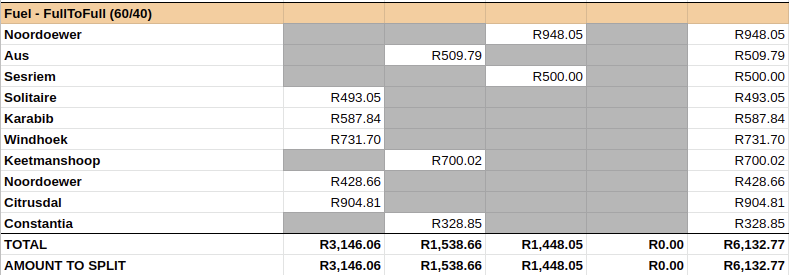

<!--
╔══════════════════════════════════════════════════════════════════════════════╗
║ README - Kaldi Keyword Spotting for SASAL                                    ║
╚══════════════════════════════════════════════════════════════════════════════╝

This is the README for the Kaldi Keyword Spotting repository avaliable at
{link}. This README contains a recipe for the set-up and implementation of a Kaldi Keyword 
Search system [1], as applied to Afrikaans, isiZulu and Sesotho.
-->

<!-------------------------- GIT PROJECT LOGO ------------------------------>
<br />
<p align="center">
  <a href="https://github.com/pieter129/KaldiSpokenTermDetectionWrapper">
    
  </a>
  <h1 align="center">KALDI KEYWORD SPOTTING</h1>
  <p align="center">
    Recipe for Kaldi Keyword system set-up and implementation. 
    <br />
    Developed for Afrikaans, Sesotho and isiZulu.
    <br />
    <br />
  </p>
</p>
<!---------------------------------------------------------------------------->

<!--
╔══════════════════════════════════════════════════════════════════════════════╗
║ Table of Contents                                                            ║
╚══════════════════════════════════════════════════════════════════════════════╝
-->
-------------------------------------------------------------------------------
## Table of Contents

* [About the Project](#about-the-project)
* [Getting Started](#getting-started)
    * [Prerequisites](#prerequisites)
    * [Installation](#installation)
* [Keyword Spotting](#keyword-spotting)
    * [Running KWS](#running-kws)
    * [Scoring KWS](#scoring-kws)
* [Sample Test Run](#sample-test-run)
* [License](#license)
* [References](#references)

<!--
╔══════════════════════════════════════════════════════════════════════════════╗
║ About The Project                                                            ║
╚══════════════════════════════════════════════════════════════════════════════╝
-->
-------------------------------------------------------------------------------
## About The Project

**Version**: 0.1
**Date**: 2020-11-03 

This repository was developed and released by [Saigen (Pty) Ltd](https://www.saigen.co.za/) as part of the 
Speech Analytics for the South African Languages (SASAL) project carried out 
with the support of the South Africa Department of Sports, Arts and Culture 
(2018-06-01 to 2021-07-31).

<!--Important Note-->

**Note**:
    * Built with Kaldi Toolkit Version 0.1 - commit 811bd21a9
    * Kaldi patches based on specified version.

<!--
╔══════════════════════════════════════════════════════════════════════════════╗
║ 1. Getting Started                                                           ║
╚══════════════════════════════════════════════════════════════════════════════╝
-->
-------------------------------------------------------------------------------
## 1. Getting Started

Instructions for the installation and setup of all toolkits and packages required to 
perform keyword spotting. It is necessary to go through the installation process 
at least once in order to be able to use keyword spotting scripts.

<!--
┌──────────────────────────────────────────────────────────────────────────────┐
│    1.1. Prerequisites                                                        │
└──────────────────────────────────────────────────────────────────────────────┘
-->
-------------------------------------------------------------------------------
### Prerequisites

*None.*

<!--
┌──────────────────────────────────────────────────────────────────────────────┐
│    1.2. Installation                                                         │
└──────────────────────────────────────────────────────────────────────────────┘
-->
-------------------------------------------------------------------------------
### Installation

There are no prerequisites, as the installation process has been designed to address 
all toolkit and package requirements needed to perform keyword spotting. Any missing 
toolkits or packages will be installed.

1. Clone the repository

   ```
   git clone https://github.com/pieter129/KaldiSpokenTermDetectionWrapper
   ```

2. Check following paths are set correctly in `conf/var.conf`:

     - `KALDI_TRUNK` (Directory containing Kaldi toolkit / where it will be installed)
     - `dir_patches` (Directory containing patches)
     - `dir_models`  (Directory containing models)

3. Run `install_kaldi.sh` to setup requirements for keyword spotting.
 
   * Checks existing software meets requirements.
   * Installs missing [Kaldi](https://github.com/kaldi-asr/kaldi) and [NIST F4DE](https://github.com/usnistgov/F4DE) toolkits.
   * Applies supplied patches to Kaldi toolkit.

   ```
   bash scripts/install_kaldi.sh
   ```
   
4. Get and Extract the models.
   
   ```
   pip install gdown
   gdown --fuzzy --no-check-certificate https://drive.google.com/file/d/1AqReow_UKIFQsxNKAZ0KrZl-ug_LhDAT/view?usp=sharing
   tar -xzvf models.tar.gz
   ```

<!--IMPORTANT NOTE-->

**Note:**

The following variables are added to `conf/var.conf` during installation.
If `install_kaldi.sh` is not run, the following lines will have to be
manually added:

    - `export   PATH=$PATH:$HOME/local/bin:$KALDI_TRUNK/kaldi/tools/F4DE/bin`
    - `export   KALDI_ROOT=$KALDI_TRUNK/kaldi`
    - `export   MODEL_ROOT=$dir_models`

<!--
╔══════════════════════════════════════════════════════════════════════════════╗
║ 2. Keyword Spotting                                                          ║
╚══════════════════════════════════════════════════════════════════════════════╝
-->
-------------------------------------------------------------------------------
## 2. Keyword Spotting

Keyword Spotting is performed by `scripts/do_all_kws_search.sh` which sets up 
the keyword search task, creating and specifying the necessary data resources 
required for the keyword search. This script also has the optional function to score 
the search results.

<!--
┌──────────────────────────────────────────────────────────────────────────────┐
│    2.1. Running KWS                                                          │
└──────────────────────────────────────────────────────────────────────────────┘
-->
-------------------------------------------------------------------------------
### 2.1. Running KWS

```
Usage: do_all_kws_search.sh [options] <in:wav_list> <in:kwd_list> 
                            <in:lang> <out:dir_work> <out:kwd_results>
```
<!--PARAMETERS-->

#### _Parameters_

- `wav_list`    : list of full file paths to audio files to be searched.
- `kwd_list`    : list of keyword phrases to search. Each keyword phrase should be on a new line. 
                  Keyword phrases can consist of single or multiple words. 
- `lang`        : [afr, sot, zul] - specifies audio language and determines which decoding model is used. 
- `dir_work`    : directory in which required resources are created.
- `kwd_results` : file to which results will be written.

<!--IMPORTANT NOTE-->

**Note:** 		

This project was developed for Afrikaans, isiZulu and Sesotho.  To use this script
for another language, the following parameters must be explicitly set and passed
in as optional arguments.:

   - `--dir_model` : Diretory containing model.
   - `--dir_graph` : Directory containing decoding graph.
   - `--dir_lang`  : Language Directory.
     
The required argument `lang` can be set to any language value.

<!--EXAMPLE-->

_**Example:**_

```
dir_model=/path/to/model
dir_graph=$dir_model/exp/chain/tdnn1g_sp/dir_graph
dir_lang=$dir_model/data/dir_lang
lang="spanish"

bash scripts/do_all_kws_search.sh --dir-model $dir_model --dir-graph $dir_graph --dir_lang $dir_lang
                                  <in:wav_list> <in:kwd_list> $lang <out:dir_work> <out:kwd_results>
```

<!--
┌──────────────────────────────────────────────────────────────────────────────┐
│    2.2. Scoring KWS                                                          │
└──────────────────────────────────────────────────────────────────────────────┘
-->
-------------------------------------------------------------------------------
### 2.2. Scoring KWS

Scoring of the keyword search results is optional, and disabled by default.
If enabled via the optional argument `--skip-scoring false`, the keyword search 
results are evaluated by the F4DE [2] scorer from NIST.

<!--PARAMETERS-->

#### _Parameters_

One of the following optional arguments must be provided:

- `--aligned-ctm aligned_ctm` : Accurately aligned `ctm` of reference files, corresponding to audio files. 
                                [Suggested option for optimal results].

- `--txt-list txt_list` : List of file paths to reference transcriptions, corresponding to audio files.
                          Transcript text must be on a single line. A `ctm` with approximate time alignments 
                          will be created from the transcription texts. [Option for basic scoring results].

<!--IMPORTANT NOTE-->

**Note:**

The user can try improve the scoring accuracy by adding the optional parameter  
`--Similarity-threshold $d` (default=0.5) to line 86 in `$KALDI_ROOT/egs/babel/s5d/local/kws_score_f4de.sh` 
and by increasing the value of `$d` (e.g. `d=5`, `d=10`).  

```
  -S, --Similarity-threshold <thresh>
      The <thresh> value represents the maximum time distance
      between the temporal extent of the reference term and the
      mid point of system's detected term for the two to be
      considered a pair of potentially aligned terms. (default: 0.5).
```

<!--EXAMPLE-->

_**Example:**_

```
bash scripts/do_all_kws_search.sh --skip-scoring false --aligned-ctm aligned_ctm <in:wav_list> 
                                  <in:kwd_list> <in:lang> <out:dir_work> <out:kwd_results>
``` 

<!--
╔══════════════════════════════════════════════════════════════════════════════╗
║ 3. Sample Test Run                                                           ║
╚══════════════════════════════════════════════════════════════════════════════╝
-->
-------------------------------------------------------------------------------
## 3. Sample Test Run

A sample test script and audio files have been provided to demonstrate the implementation
of the keyword spotting scripts, and to ensure everything has been installed correctly. 
The sample audio provided consists of three short South African parliamentary clips 
in Afrikaans, isiZulu and Sesotho. 

The sample test script uses the Afrikaans resources by default. You can change the language
by setting the `lang` argument on Line 14 in the sample script to one of the following options: 
[ afr | sot | zul ].

Scoring with an aligned ctm is implemented by default. To disable scoring or 
change scoring method, see optional parameter settings.

```
Usage:  do_keywords_test.sh [options]
```

<!--PARAMETERS-->

#### _Parameters_

To change or disbale scoring; pass one of the following optional parameters as set: 

- `--aligned-ctm false` : Score using text files as reference.
- `--score false` : Disable scoring during test run.


<!--EXAMPLE-->

_**Example:**_

```
bash scripts/do_keywords_test.sh --score false
```

<!--
╔══════════════════════════════════════════════════════════════════════════════╗
║ 4. License                                                                   ║
╚══════════════════════════════════════════════════════════════════════════════╝
-->

## 4. License

Distributed under the [Creative Commons Attribution 4.0 License](https://creativecommons.org/licenses/by/4.0/legalcode).
See `LICENSE` for more information.

<!--
╔══════════════════════════════════════════════════════════════════════════════╗
║ 5. References                                                                ║
╚══════════════════════════════════════════════════════════════════════════════╝
-->

## 5. References
[1] (https://kaldi-asr.org/doc/kws.html)  
[2] (https://github.com/usnistgov/F4DE) 

